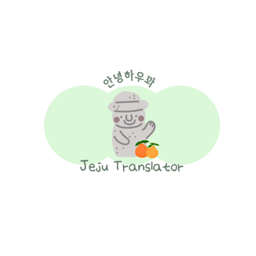

# jejutranslater
제주도 사투리를 번역하는 번역기 프로젝트 입니다.

# 로고 

# 프로젝트 배경
---

### 프로젝트 개요

- 2011년 12월 유네스코가 지정하는 ‘소멸위기 언어’ 5단계 중 4단계인
    
    ‘**아주 심각한 위기에 처한 언어**’에 등재
    
- 표준 한국어 교육이 이뤄지고 균질화된 대중매체, **정보통신 발전에 따른 언어의 보편화**

### 프로젝트 목표

- 제주도 사투리를 번역하는 번역기를 만들자!

### 프로젝트 기대효과

- 번역기를 통해 사투리가 활성화 되기를 기대
- 고유문화인 사투리를 보존

# 사용 데이터

---

**AI-Hub 제주도 방언 발화(한국어)**

[AI-Hub](https://aihub.or.kr/aihubdata/data/view.do?currMenu=115&topMenu=100&aihubDataSe=realm&dataSetSn=121)

조용한 환경에서 제주도 지역 2000명 이상의 10대 ~ 60대 의 연령별 화자가 

발화한 3000 시간 이상의 음성 데이터와 맵핑 된 담화 텍스트 말뭉치

위의 내용이 메타 정보와 데이터화 되어 구성된 JSON 포맷의 학습 데이터 파일

- **사투리와 표준어 구분**
    - Standard_form : 표준어 문장
    - Dialect_form : 사투리 문장
    - Eojeol / standard 의 단어가 같으면 ‘isDialect:False’ (표준어)
    - Eojeol / standard 의 단어가 같으면 ‘isDialect:True’ (사투리)